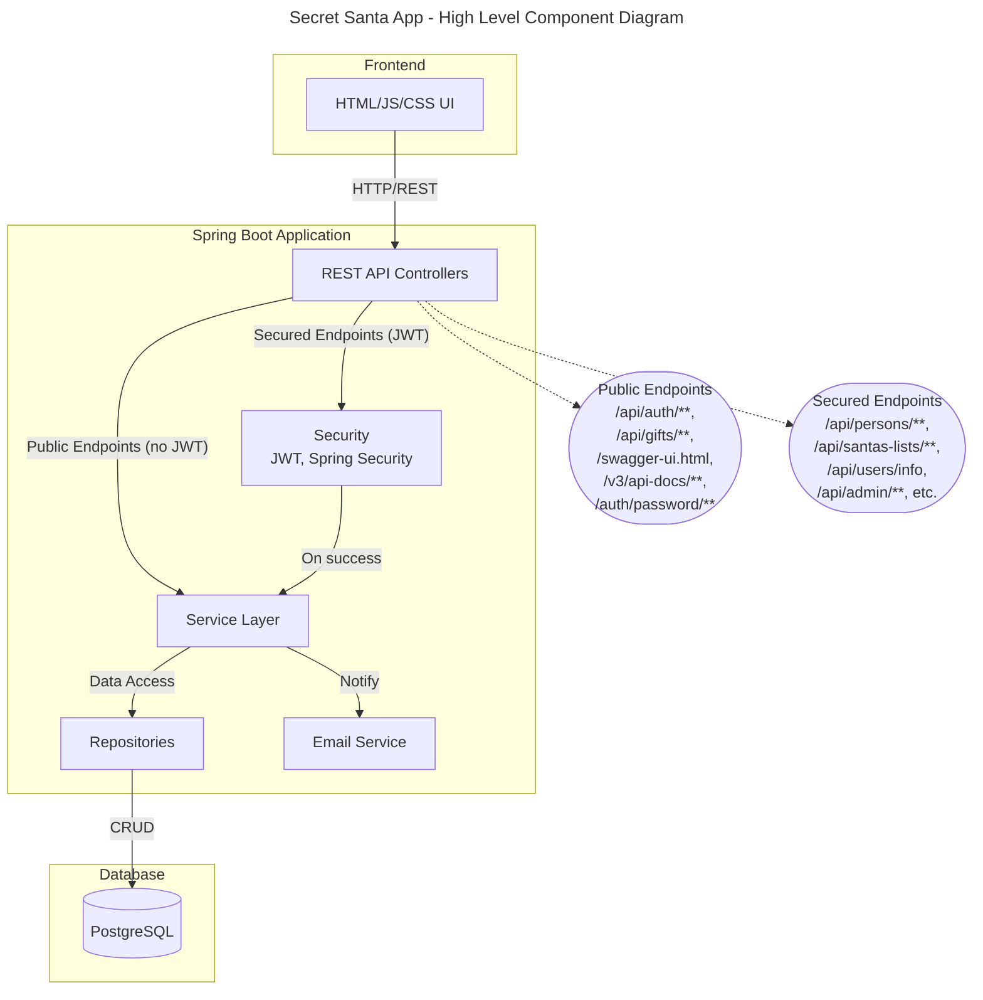
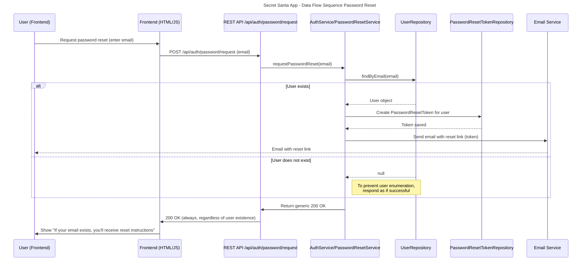
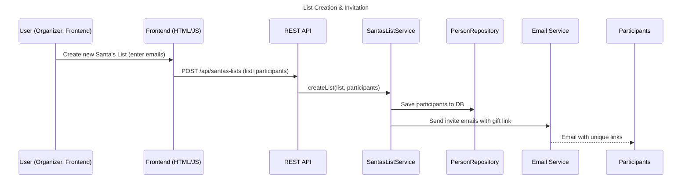
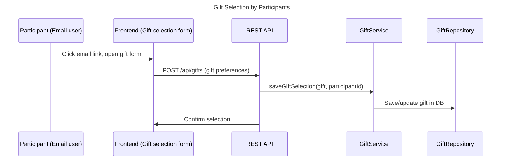
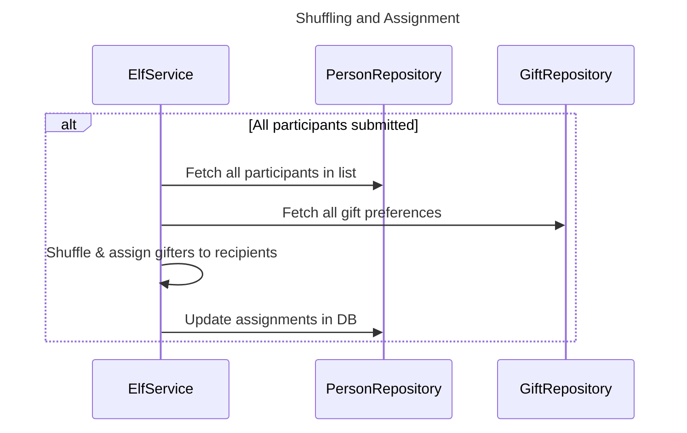
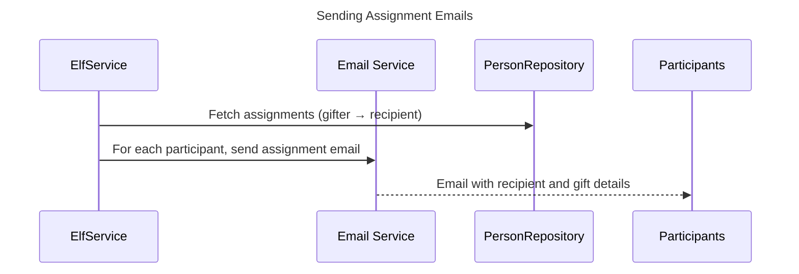

# 🎅 Secret Santa App

#### A Java Spring Boot application to automate your Secret Santa gift exchange – from participant invitation to anonymous gift assignment, all done via email!
-  **Add participants by email**
-  Automatically sends email invitations with gift preference form
-  Once all participants submit their preferences, the app assigns gifters and emails gift details

---

## ✨ Features

- ✅ Account creation & secure login with JWT
- 🔒 Password reset functionality
- 🔐 Secure authentication 
- 📦 REST API documented 
- 📈 Well tested (91% line coverage)
- 📨 Email delivery via SMTP
- 💡 Clean architecture using Lombok and MapStruct

---

## 🛠️ Tech Stack

- Java 17
- Spring Boot 3.4.4
- PostgreSQL
- Spring Security + JWT
- Spring Mail (Seznam.cz SMTP)
- MapStruct + Lombok
- JUnit 5 + Mockito
- OpenAPI (Springdoc)
- Jakarta Validation
- Docker & Docker Compose
- JavaScript, HTML, CSS (for frontend)

---

# 🚀 Quick Start

##  Requirements
- Docker & Docker Compose installed
- Java 17 and Maven (for local builds)

---


### 🔄 Run with Docker Compose

#### 1. Create a `.env` file in the root directory with your configuration:
```env
# Database
DB_URL=jdbc:postgresql://db:5432/postgres
POSTGRES_USER=${YOUR_POSTGRES_USER}
POSTGRES_PASSWORD=${YOUR_POSTGRES_PASSWORD}

# JWT
JWT_SECRET=${YOUR_JWT_SECRET_THAT_IS_LONG_ENOUGH_TO_BE_HASHED_BY_SHA-256}
JWT_EXPIRATION=3600000

# Mail
MAIL_HOST=smtp.seznam.cz
MAIL_PORT=465
MAIL_USERNAME=${YOUR_EMAIL}
MAIL_PASSWORD=${YOUR_EMAIL_PASSWORD}

# Application specific
FE_BASE_URL=http://127.0.0.1:5501
CHECK_INTERVAL=360000
EMAIL_ENABLED=false
RESET_TOKEN_EXP_MIN=15

#SECURITY
CORS_ALLOWED_ORIGINS=http://127.0.0.1:5500;http://127.0.0.1:5501
```
Make sure to replace the placeholders with `$` sign with your actual values.

#### Environment Variables Reference

| Variable               | Description                                 | Example/Default                            |
|------------------------|---------------------------------------------|--------------------------------------------|
| DB_URL                 | JDBC URL for SQL database                   | jdbc:postgresql://db:5432/postgres         |
| POSTGRES_USER          | Database username                           | postgres                                   |
| POSTGRES_PASSWORD      | Database password                           | secret                                     |
| JWT_SECRET             | Secret key for JWT signing                  | (long random string)                       |
| JWT_EXPIRATION         | JWT expiration in ms                        | 3600000                                    |
| MAIL_HOST              | SMTP server host                            | smtp.seznam.cz                             |
| MAIL_PORT              | SMTP server port                            | 465                                        |
| MAIL_USERNAME          | SMTP username/email                         | you@seznam.cz                              |
| MAIL_PASSWORD          | SMTP password                               | emailpassword                              |
| FE_BASE_URL            | Frontend application base URL               | http://127.0.0.1:5501                      |
| CHECK_INTERVAL         | Check interval for Lists eligible for sending (ms) | 360000                                     |
| EMAIL_ENABLED          | Enable/disable email sending                | false                                      |
| RESET_TOKEN_EXP_MIN    | Password reset token expiration (minutes)   | 15                                         |
| CORS_ALLOWED_ORIGINS   | Allowed CORS origins (semicolon-separated)  | http://127.0.0.1:5500;http://127.0.0.1:5501 |

Place these in your `.env` file in the project root.


#### 2. Start the application

```bash
docker-compose up --build
```

- `Docker-compose.yml` actually mounts local maven repository, so after initial build, subsequent builds will be faster.

#### 3. Access the application
Once the application is running, you can access it at:
- Swagger UI: http://localhost:8080/swagger-ui.html
- OpenAPI: http://localhost:8080/v3/api-docs
- Frontend: http://localhost:5501/login

---

### ‍💻 Manual Setup (Local Development)

#### 1. Clone the repository

```bash
git clone https://github.com/your-username/secret-santa.git
cd secret-santa
```

#### 2. Create .env file
Include .env file in the root directory with your configuration as described above in `🔄Run with Docker Compose` section

#### 3. Create a PostgreSQL database

You can run a local container or use your own database. Example using Docker:

```bash
docker run --name secretsanta-db -e POSTGRES_DB=postgres -e POSTGRES_USER=youruser -e POSTGRES_PASSWORD=yourpass -p 5432:5432 -d postgres
```
Make sure to replace `youruser` and `yourpass` with your desired credentials.

#### 4. Run the application
Since the application is not running as container, the datasource url needs to be overridden by using dev profile.
```bash
mvn spring-boot:run -Dspring.profiles.active=dev
```

---

# ✅Test Coverage

## Coverage Insights

- The application demonstrates robust overall coverage, with 97% of classes, 90% of methods and 91% of lines exercised by tests.
- Core modules—**config**, **entity**, **exception**, **mapper** and **service**—achieve near–100% coverage, reflecting comprehensive validation of the business logic.
- The **controller** (70% methods/lines) and **DTO** (77% lines) layers present the largest gaps; enhancing endpoint and mapping tests in these modules is necessary if ever want to deploy to **PROD**.
- The `SecretSantaApplication` entry point is currently untested (0%); adding a startup or integration test will immediately improve the coverage metrics.


| Module                                  | Classes            | Methods             | Lines               |
|-----------------------------------------|--------------------|---------------------|---------------------|
| **Overall** (cz.oluwagbemiga.santa.be)  | 97% (45/46)        | 90% (156/172)       | 91% (656/718)       |
| **config**                              | 100% (1/1)         | 100% (7/7)          | 100% (30/30)        |
| **controller**                          | 100% (7/7)         | 70% (19/27)         | 70% (36/51)         |
| **dto**                                 | 100% (11/11)       | 93% (14/15)         | 77% (14/18)         |
| **entity**                              | 100% (4/4)         | 78% (11/14)         | 83% (20/24)         |
| **exception**                           | 100% (7/7)         | 92% (13/14)         | 86% (20/23)         |
| **mapper**                              | 100% (4/4)         | 100% (20/20)        | 90% (155/171)       |
| **repository**                          | 100% (0/0)         | 100% (0/0)          | 100% (0/0)          |
| **security**                            | 100% (2/2)         | 100% (7/7)          | 100% (43/43)        |
| **service**                             | 100% (9/9)         | 97% (65/67)         | 94% (338/357)       |
| **SecretSantaApplication**              | 0% (0/1)           | 0% (0/1)            | 0% (0/1)            |


*You can run the tests using Maven:*
```bash
mvn test
```
Unfortunately, the coverage report is not generated automatically, since I prefer using integrated IDE tools for coverage analysis.  
I plan to include Jacoco plugin directly in the project in the future, so that the report can be generated automatically when pull request is created.

---

# 🛡️ Using the Validator Bean

The Secret Santa App leverages Spring's built-in validation for robust data integrity. The `Validator` bean (from `jakarta.validation.Validator`)

- Fields in DTOs are annotated with validation constraints (e.g., `@NotNull`, `@Email`, `@Size`, etc.).
- The Validator bean is injected where manual validation is needed (e.g., in services for custom flows).

#### This:
- Ensures data received from API clients adheres to business rules.
- Prevents invalid or incomplete data from being persisted.
- Offers consistent and reusable validation logic across the application.
---

# 🗺️ Architecture & Data Flow

## High-Level Component Diagram

Clear separation of concerns is enforced by splitting the app into:
- Frontend (UI layer)
- API Controllers (entry points)
- Service Layer (business logic)
- Repositories (data access)
- Security & Email (cross-cutting concerns)

This modularity boosts maintainability, makes unit testing straightforward, and allows each piece to scale independently.

---

## Data Flow Sequence for Password Reset
#### Privacy & Security:
I always return “200 OK” to avoid revealing whether an email exists (prevents user enumeration).

#### Single-responsibility:
Token creation, persistence, and email sending are handled in the service layer, decoupling concerns and simplifying tests.

---
## End-to-End Workflow Sequence

This sequence shows how the Secret Santa App guides an organizer and the participants through the entire gift-exchange process. From creating a list of invitees all the way through to delivering each person’s recipient assignment. It’s designed to ensure:

- Simplicity for the organizer (one form to fill out)
- Security (JWT-protected APIs, tokenized password resets, no user enumeration)
- Reliability (automatic checks on completion, retries on failure)
- Clarity in communication (generic “200 OK” responses, personalized emails with unique links)

### 1. List Creation & Invitation
When the organizer submits a new Santa’s list, the backend:

- Persists the list and participant emails in the database as `Person` entities
- Generates a unique gift-selection link for each address
- Sends out invitation emails 

This decoupling (controller → service → repository → email) keeps each component focused on a single responsibility, making it easy to test and scale.

### 2. Gift Selection by Participants
Each invitee clicks their personalized link and submits gift preferences. Behind the scenes:

- The front end posts preferences to the GiftController
- GiftService validates `GiftDTO`, changes `ListStatus` to `SELECTED` and saves `Gift` entity
- A confirmation response is returned to ensure the participant knows their selection was recorded.



### 3. Shuffling and Assignment
Once everyone’s selections are in:

- Periodically, the `ElfService` checks if all participants have submitted their preferences.
- If conditions are met, it triggers the shuffle and assignment process.
- `ElfService` service fetches all participants and their preferences
- It runs a **shuffle** algorithm from `java.util.Collections.` to pair gift-givers with recipients
- Assignments are written back to the database

*By isolating “shuffle & assign” in its own service method, I can swap in a more sophisticated matching algorithm later without touching the rest of the code. E.q excluding some participants from being assigned to each other.*

### 4. Sending Assignment Emails
Finally, `ElfService` sends out assignment emails to each participant:

- Retrieves the new gifter → recipient map
- Iterates through each`Person` and `Gift` and builds custom email content.
- Sends each participant an email with their recipient’s details

*Batching these sends and using the same EmailService interface used during invitation guarantees consistent formatting and retry logic across the entire flow.*



---

## 🏗️ Contributing

Unfortunately, I am not accepting contributions at the moment. Feel free to fork the repository and use it for your own purposes. If you have any suggestions or improvements, please let me know by opening an issue.

---

## ❓ FAQ

#### Q: Why am I not receiving emails from the app?
- **A:** Check your SMTP configuration in `.env`. Ensure `EMAIL_ENABLED=true` and that your credentials are correct. Some providers may block automated emails or require app passwords.

#### Q: How do I add more participants after creating a list?
- **A:** Currently, lists are immutable after creation to ensure fairness. Create a new list to include additional participants.

#### Q: Why is there an `Admin` role in the app?
- **A:** The `Admin` role is reserved for adding affiliate link to `Gift` entity.
--- 

## 🚨 Reporting Issues

If you find a bug or have a feature request, please [open an issue](../../issues) and provide as much detail as possible.

Thank you for helping improve this project!


---
## 🙋‍♂️ Support

If you encounter issues or have questions:

- **Open an issue** in this repository with details about your problem or suggestion.
- You may contact the maintainer via  [LinkedIn](www.linkedin.com/in/daniel-rakovsky-96ba74317).


## 📄 License
This project is licensed under the MIT License. So feel free to use, modify, and distribute it as you wish!  